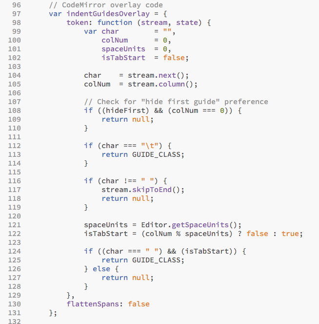
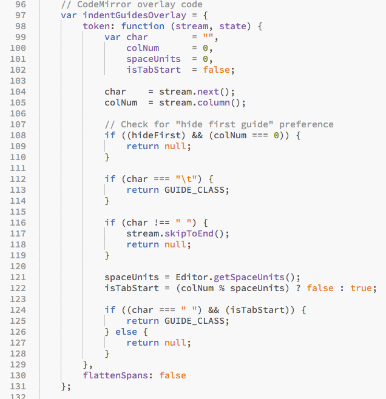
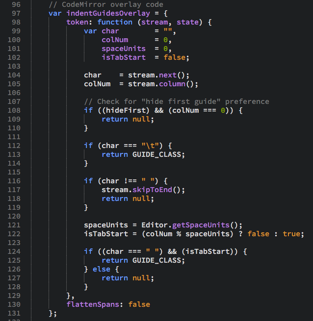
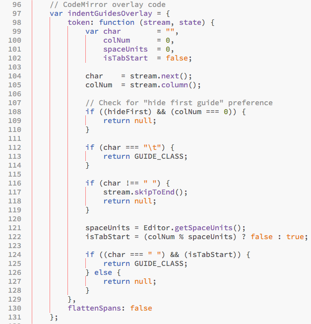

# Indent Guides for Brackets
An extension for [Brackets](https://github.com/adobe/brackets/) to show indent guides in the code editor.

### How to Install
1. Select **Brackets > File > Extension Manager...**
2. Search for this extension.
3. Click on the **Install** button.

### How to Use Extension
Toggle the extension with **View > Indent Guides**.

## Screenshots:

**Life without Indent Guides**:

**Life *with* Indent Guides**:

**Works great in the dark as well**:

**Preferences let you control the style and color**:

### Extension Preferences

**`brackets-indent-guides.enabled`** *(boolean)* 
Determines whether the indent guides will be shown or hidden.

**`brackets-indent-guides.hideFirst`** *(boolean)* 
Determines whether the first Indent Guide will be hidden or shown.

**`brackets-indent-guides.guideColor`** *(string)* 
The color of the indent guides. Can be any valid CSS Color value.

**`brackets-indent-guides.guideStyle`** *(string)* 
This value determines the style of the guide: "solid" or "dotted".

For more information on setting preferences see [How to Use Brackets - Preferences](https://github.com/adobe/brackets/wiki/How-to-Use-Brackets#preferences)

### Custom Key Bindings

If you would like to add a customized keyboard shortcut to toggle indent guides,
set your shortcut key to the following command id: `lkcampbell.toggleIndentGuides`.

For example, if you want the shortcut `Ctrl-Shift-I` to toggle the indent guides,
type the following entry into the `overrides` section of your `keyboardmap.json`
file:

`"Ctrl-Shift-I": "lkcampbell.toggleIndentGuides"`

For more information on setting Custom Key Bindings see [User Key Bindings](https://github.com/adobe/brackets/wiki/User-Key-Bindings).

### Code Challenges

Code challenges are closed issues and enhancement requests that I have attempted
to resolve without success. Maybe you have an idea that will help?

Just look for the `code challenge` label in the closed issues list. Post a comment
on the issue and we can discuss your solution ideas. Here is a list of the current
code challenges for this extension:

1. [Empty lines do not display indent guides](https://github.com/lkcampbell/brackets-indent-guides/issues/16)
1. [Show only one indent guide in hanging indent](https://github.com/lkcampbell/brackets-indent-guides/issues/11)
1. [Indent guides make scrolling less performant](https://github.com/lkcampbell/brackets-indent-guides/issues/12)
1. [Only show indent guides when text is present on line](https://github.com/lkcampbell/brackets-indent-guides/issues/15)

### License
MIT-licensed -- see `main.js` for details.
